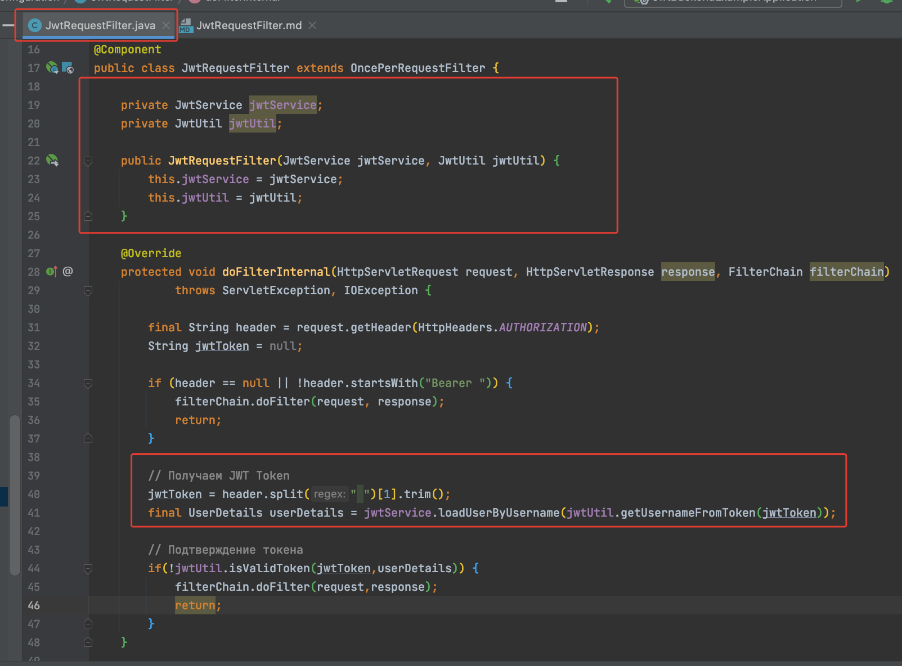

# Создаем JwtRequestFilter 
В пэкэйже configuration создаем новый класс фильтр JwtRequestFilter

Если Header авторизации не пустой и начинается с Bearer то приступаем к получению
токена

Если токен не валидный то  также передаем дальше filterChain

Установка пользователя в Spring Security Context (авторизация через токен)

Сейчас этап фильтрации прошел, все хорошо, мы авторизовали в контексте  пользователя 
и отправляем его дальше на WebSecurityConfigurer
