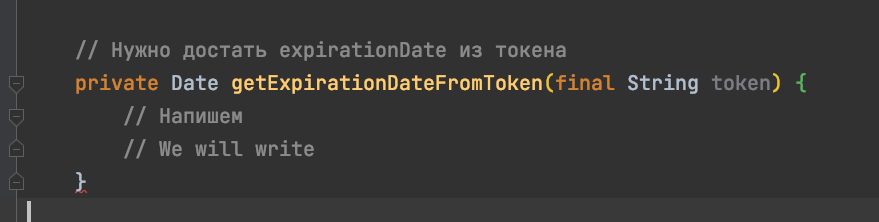
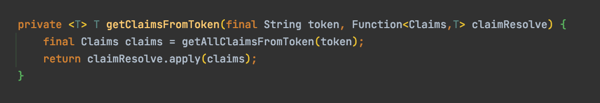
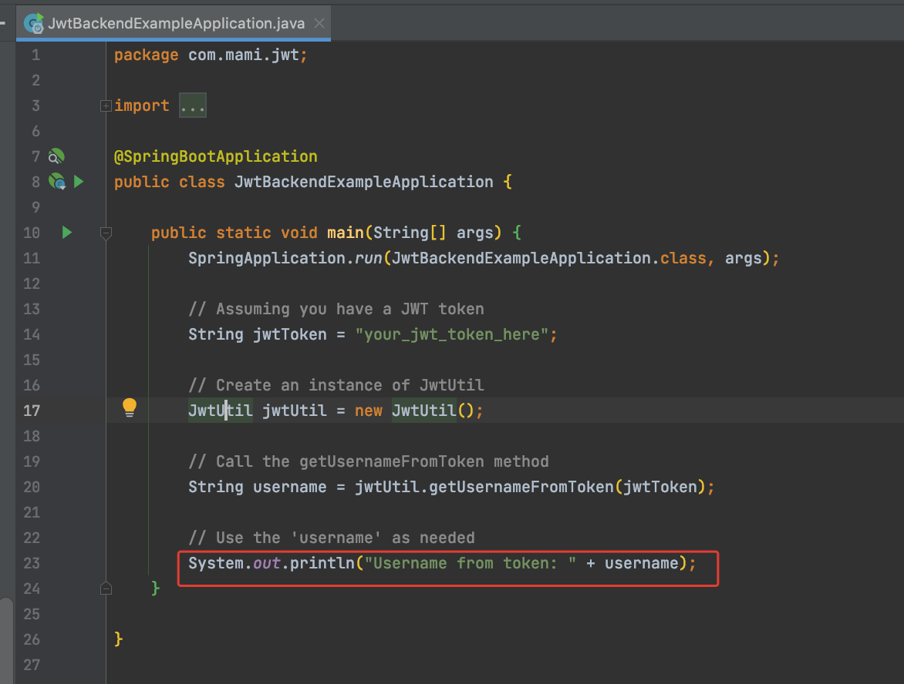
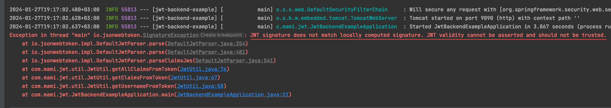
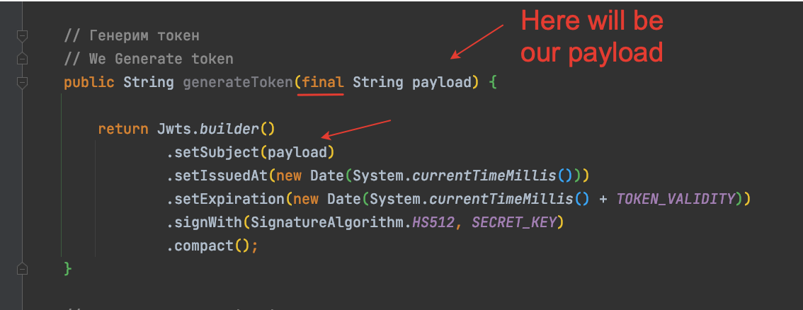
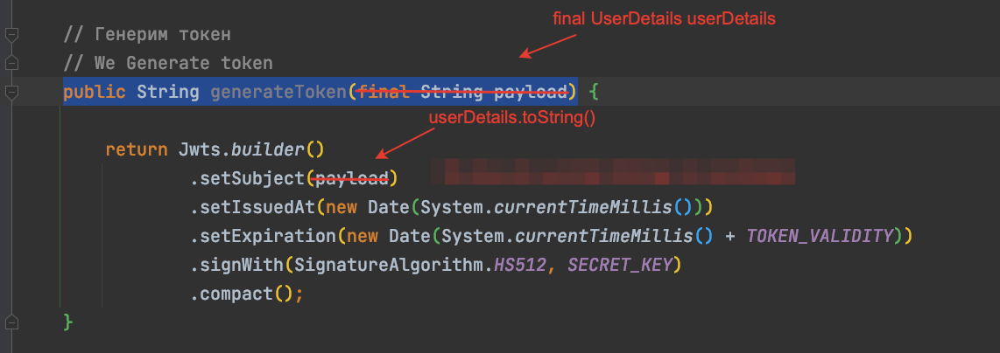
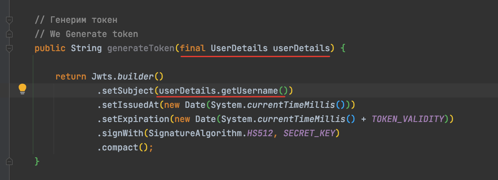

# Создаем класс JwtUtil

Payload таже называется Claims

SECRET_KEY будет содержать секретное слово спомощью которым шифруется payload
TOKEN_VALIDITY - 60 sec * 60 min * 5 hour * 1000 ms - Время жизни токена
  Генерим токена

  Достаем expirationdate из токена

  Токен истек или нет

  Проверка токена на валидацию

  Пишем метод getUserNameFromToken()

  Реализум метод getClaimsFromToken(), для этого нам понадобится еще один 
вспомогательный метод getAllClaimsFromToken()

Вызываем getAllClaimsFromToken() внутри getClaimsFromToken()

Возвращаемся к _private Date getExpirationDateFromToken(final String token)_ 

Возвращаемся к  _public String getUsernameFromToken(final String token)_

Протестируем как работает метод, сделаем вызов в main методе.

Получаем ошибку

Добавляем зависимость 

Получаем другую ошибку, но уже связанную с неправильным токеном

Генерируем на сайте jwt token, но все равно получаем ошибку

Дальше пишем JwtUtil класс
ObjectMapper - обьект данного класса позволяет замапить строчку в Json или
наборот из Json прочитать значение по ключу

Делаем небольшой рефакторинг по методу generateToken()

Запускаем еще один тест, с помощью главного метода spring boot генерируем новый токен

eyJhbGciOiJIUzUxMiJ9.
eyJzdWIiOiJ7XG4gIFwidXNlck5hbWVcIjogXCJBbGV4XCIsXG4gIFwidXNlclBhc3N3b3JkXCI6IFwicGFzc3dvcmRcIlxufSIsImlhdCI6MTcwNjM3NTg1NywiZXhwIjoxNzA2MzkzODU3fQ.
YmtVcycOywxafymiL2raLcVxFn_mt6U1YgEyKm1sa4gQqeQDpd3WvcKj5tHvJBf-qbmyKek2GCJujxHVqp4dwA

Вставляем сгенерированный токен в строку и запускаем заново приложение чтобы протестить метод
_public String getUsernameFromToken(final String token)_

Какую информацию будем класть в payload чтобы сгенерировать jwt token ? 
Будем класть Информацию о пользователе , тогда надо рефакторить метод 
_public String generateToken(final String payload)_ 

