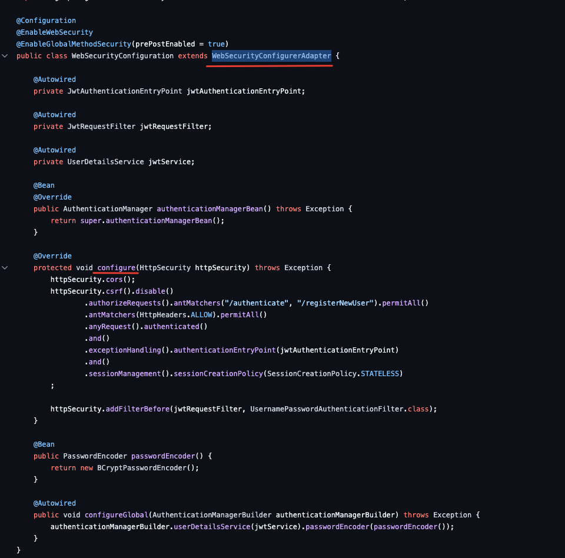
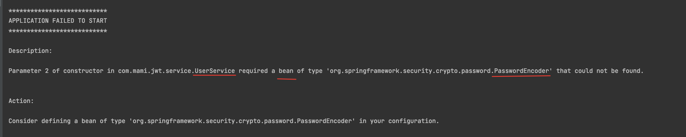

# Создаем WebSecurityConfigurer

Пишем метод securityFilterChain()

В SpringBoot 2 мы  расширяли класс _WebSecurityConfigurerAdapter_  
переопределяли  метод _configure()_

Добавляем классу еще один бин

Запускаем приложение и получаем ощибку 

Создаем еще один бин

