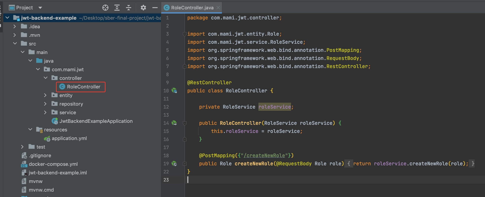
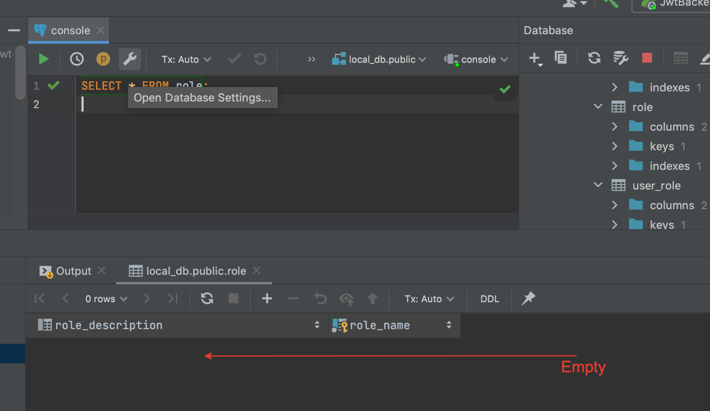
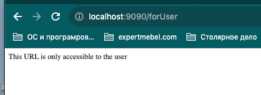
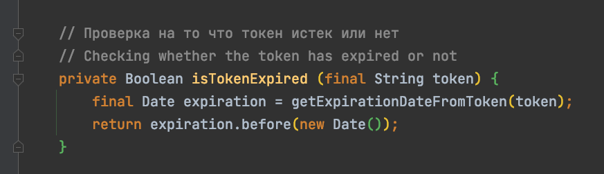
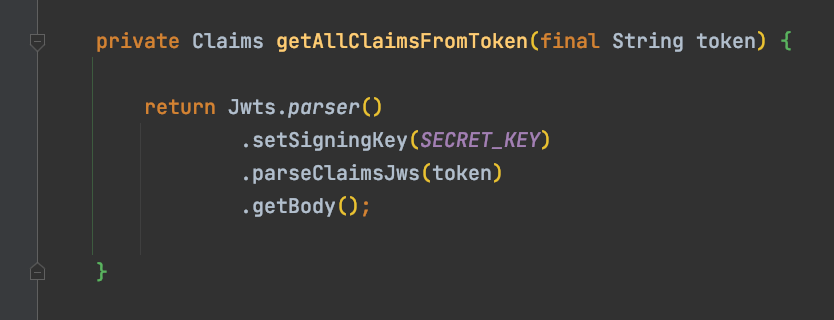

# Token and Role Base Authentication Using Spring Boot 3 + JWT + Postgres

This repository serves as a comprehensive tutorial demonstrating the implementation of Tokens and Role management using 
Spring Boot 3, JWT, and Postgres. Unlike a simple example, this tutorial provides in-depth insights and hands-on 
guidance for a robust implementation.

### 1 - Create a new project with spring initalizr

I left the Dependencies section blank as we will be adding the dependencies externally.

### 2 - Add Dependecies to pom file

We will add those three dependencies at the first time.

 
_spring-boot-starter-data-jpa_  -> it will help us create entities
 
_spring-boot-starter-web_       -> it will help us create endpoints
 
_postgresql_                    -> it will help us build connection between spring app and postgresql

### 3 - Rename application.properties file to .yml

 Add properties  

### 4 - With docker compose run a new postgres container 
Docker Compose is a tool for defining and running multi-container Docker applications. 
Here's a basic guide on using Docker Compose:

- Ensure that Docker Compose is installed on your system. You can download it from the official Docker Compose
GitHub repository: https://github.com/docker/compose/releases
- Create a docker-compose.yml file in your project directory.

- Open a terminal, navigate to the directory containing your docker-compose.yml file, and run:

 

### 5 - Connect to the db inside Intellij Idea
I'm using IntelliJ IDEA Ultimate Edition. If you are using the Community Edition, you may not have the Database 
connection feature inside IntelliJ IDEA.

### 6 - Writing Code (Packages abd Role)

 - Creating packages , package structuring 

 - Creating entity - Role 

 - Creating interface RoleRepository 

 - Creating service RoleService 

 - Creating controller RoleController 

Before launch first time the application, if we drill inside db on Postgres 

 After launch the app 

### 7 - Test With Postman

 - #### Create new role as Admin 

After sending Post request with Postman, we have a record inside role table.

   
 - #### Create new role as User

SQL Query

### 8 - Writing code (User Entity, Controller, Repo and Service)
In similar we have to create a new entity for the User that I will call AppUser. 
Let's use JPA annotations to establish MANY-to-MANY relationships between AppUser and Role entities.

And Repository, Service and Controller.

  Now when we relaunch teh app , we have 3 tables in our db

 When we send a query , now we have the previous records erased.

  Records are erased because every time when we relaunch the app , we will have a new creation, it's mentioned in 
application.yml file

### 9 - Init method for DB data
In UserService class we create a new public method

method initRolesAndUsers(){}

Call this method inside Controller, it's important to add PostConstruct annotation

Now when we query tables , we have 

Pay attention that password is not encoded after yet , will do it later 
And user_role is empty because we have to change init method

<strong> Setting roles </strong>

Now user_role has records because we have setted roles in init method

### 10 - Creating Endoints forAdmin and forUser in UserController

### 11 - Adding JWT and Spring security dependencies in pom.xml

Now we have default security working on the server side.
Whe we launch the app and try to hit endpoints , Spring security ask for login.

### 12 - Global CORS (Cross Origin Ressource Sharing) configuration
[CORS with Spring](https://www.baeldung.com/spring-cors)

We create a new package _configuration_ and new class inside 

### 13 - Creating JwtAthenticationEntryPoint class
In the context of Spring Security and JWT (JSON Web Token) authentication, the term "authentication entry point" 
refers to the component responsible for handling authentication failures and initiating the authentication process. 
When a user attempts to access a secured resource without proper authentication or with an invalid JWT token, the 
authentication entry point comes into play.

In a Spring Security configuration with JWT authentication, you typically configure an authentication entry point using 
the AuthenticationEntryPoint interface. The commence method of this interface is invoked when authentication fails, and 
it's responsible for initiating the authentication process or handling the failure appropriately.

### 14 - Creating JwtUtil class

[  Russian text](JwtUtil-rus.md)

The payload is also called Claims. 

This class provides methods for generating, validating, and extracting information from JSON Web Tokens (JWTs) used for authentication in a Spring Boot application.We can found on the net this class also called _JwtTokenProvider_

We create new package _util_ and class _JwtUtil_ annotated with _component_ annotation 

The SECRET_KEY will contain a secret word used to encrypt the payload. 
TOKEN_VALIDITY - 60 sec * 60 min * 5 hours * 1000 ms - Token validity period. 
In production, we need to securely store the secret key.

We generate token 

We extract the expiration date from the token.

 Has the token expired or not?

Token validation check

We write the method getUserNameFromToken()

We implement the method getClaimsFromToken(), for which we will need another auxiliary method getAllClaimsFromToken()

We call _getAllClaimsFromToken()_ inside _getClaimsFromToken()_

We return to the private method _private Date getExpirationDateFromToken(final String token)_

We return to the public method _public String getUsernameFromToken(final String token)_

Let's test how the method works, make a call in the main method

We are getting an error

We add a dependency

We get another error, but now it's related to an invalid token

We generate a JWT token on the website, but still, we receive an error. 
The error is related to the fact that the generated token on the website cannot be read on the local server.

We will need the ObjectMapper from com.fasterxml.jackson . 
ObjectMapper - an instance of this class allows mapping a string to JSON or vice versa, reading a value from JSON based on a key.

We  do a small refactoring for the method generateToken()

We run another test using the main method of Spring Boot. We generate a new token using our local server

eyJhbGciOiJIUzUxMiJ9.
eyJzdWIiOiJ7XG4gIFwidXNlck5hbWVcIjogXCJBbGV4XCIsXG4gIFwidXNlclBhc3N3b3JkXCI6IFwicGFzc3dvcmRcIlxufSIsImlhdCI6MTcwNjM3NTg1NywiZXhwIjoxNzA2MzkzODU3fQ.
YmtVcycOywxafymiL2raLcVxFn_mt6U1YgEyKm1sa4gQqeQDpd3WvcKj5tHvJBf-qbmyKek2GCJujxHVqp4dwA

We insert the generated token into the string and restart the application to test the method
`public String getUsernameFromToken(final String token)`

So, what information will we put in the payload to generate a JWT token? We will include user information, so we need to refactor the method _public String generateToken(final String payload)_ 

### 15 - Creating JwtService
In _service_ package we create a new class JwtService that will implement _UserDetailsService_ interface

### 16 - Creating and implementing JwtRequestFilter

[  Russian text](JwtRequestFilter-rus.md)

JwtRequestFilter is a custom filter responsible for extracting the JWT token from the request and
authenticating the user.

In the configuration package, create a new class, JwtRequestFilter . 
Annotate it with _@Component_ and extend it like below.

If the Authorization header is not empty and starts with Bearer, then we proceed to obtain the token.

If the token is not valid, we also pass it along to the filterChain

Next is setting the user in the Spring Security Context (authorization via token)

Now that the filtering stage is complete, everything is good; we have authorized the user in the context and send them further to WebSecurityConfigurer that we will write in the next

### 17 - Creating WebSecurityConfigurer class

[  Russian text](WebSecurityConfigurer-rus.md)

In package _config_ we add a new config class WebSecurityConfigurer class

We write the method securityFilterChain()

In Spring Boot 2, we extended the class _WebSecurityConfigurerAdapter_ and overridden the method _configure()_

We add another bean to the class

 1 - `@Bean`: This annotation indicates that the method produces a bean to be managed by the Spring container. In this case, it's a bean of type AuthenticationManager. 
 2 - This method takes an `AuthenticationConfiguration` as a parameter and returns an `AuthenticationManager`. The `AuthenticationConfiguration` parameter is injected by the Spring framework. 
 3 - `authenticationConfiguration.getAuthenticationManager()`: The method uses the injected `AuthenticationConfiguration` to retrieve an `AuthenticationManager` instance. This method call is responsible for obtaining or configuring the `AuthenticationManager` that will be used in the application.

 In the context of Spring Security, the `AuthenticationManager` is a core interface responsible for authenticating an `Authentication` request. It delegates the authentication process to the configured `AuthenticationProvider(s)`. This bean configuration is crucial for handling authentication within a Spring Security-enabled application.

We run the application and get an error(This run was done after  JwtService was completely implemented , not t this stage )

We create another bean `bCryptPasswordEncoder()`

### 18 - Creating JwtRequest and JwtResponse entity

In the `entity` package, let's create two entities classes JwtRequest and JwtResponse

### 19 - JwtController and implementing JwtService
Let's create a new controller for authentication of user

Back to JwtService class to implement `public JwtResponse createJwtToken(JwtRequest jwtRequest)`

### 20 - Password Encryption
Before we finish , we ha to encrypt the password because the password is not encrypted.
If we make a query to db we will have this

We have a bean which ise declared in `WebSecurityConfigurer` class

We will use it in `UserService` class and we will create a new method 
`public String getEncodedPassword(String password)`

We have to call this method from `adminAppUser.setUserPassword( here  )`
and `appUser.setUserPassword( here  )`

Now we have our password in encrypted format

### 21 - Postman testing JWT request and response

When we run the application we have this error

To resolve this , after some search I add @Lazy annotation to JwtService constructor

Now the app is launched and let's test with postman

Let's test our spring security , we have created before two end points `forUser` and `forAdmin`.
We will try to have access to those end points without authentication

In the video we can see that spring security does not allow access to resources.

Let's trywith user authentication and see how we can have access to user  and admin resources.
 In This short video we see how we have access to forUser and forAdmin resources with user JWT authentication.  It's incorrect , the forAdmin resource must be unauthorized for the user.

We have to add some corrections to the code, we want when we login with `user` , the `forAdmin`
endpoint will be inaccessible for the user and when we login with `admin` , the `forUser` endpoint also inaccessible for the `admin`

In `UserController` we add 2 annotations `@PreAuthorize("hasRole('Admin')")` and `@PreAuthorize("hasRole('User')")`

Let's test.
First we will login (send request) as user, and test access forUser and forAdmin resource
Second we will test (send request) as admin, and test access forUser and forAdmin resource

### 21 - Finishing the project

While checking the application's functionality, I noticed errors. To address this, I will add SL4J for logging and 
proceed to identify the issues.

Let's add two loggers to Controller and to the Filter

As in the video we see, we have first log in the JwtRequestFilter and after int the JwtController. 
If we take the first pic in the tutorial , we can say that we are here

Let's continue testing the app.
We will add logger to JwtUtil

Now after sending request at this level - watch next video

We have this logs and errors

Method `getUsernameFromToken()` is called two times and two times an error is catched.
Let's correct the error
We don't need ObjectMapper from com.fasterxml.jackson and we remove this part from method.

Only think we left back is removing the "Hard Coding" in `UserService`

If we want to create a new user , we have to create a new Rest Endpoint.
We will only keep one admin because creating admin by user is not a great idea.

We have one Rest Endpoint in UserController `/registerNewUser`.
And if new user comes and register himself as admin is not a good idea.
So we are not going allow the user to register as admin.
We are going keep our one default record as admin and rest of records will be by default having the user roles;

Editing `registerNewUser()` method

Let's Test the app. After running the app , we have one record in db.

Let's try to register new user with Postman

There is an error on `UserController` 

Now all it;s ok 

Inside db we have the newly registered user

One user can have more than one role, in this case you have change here.

Thank you for reading.

